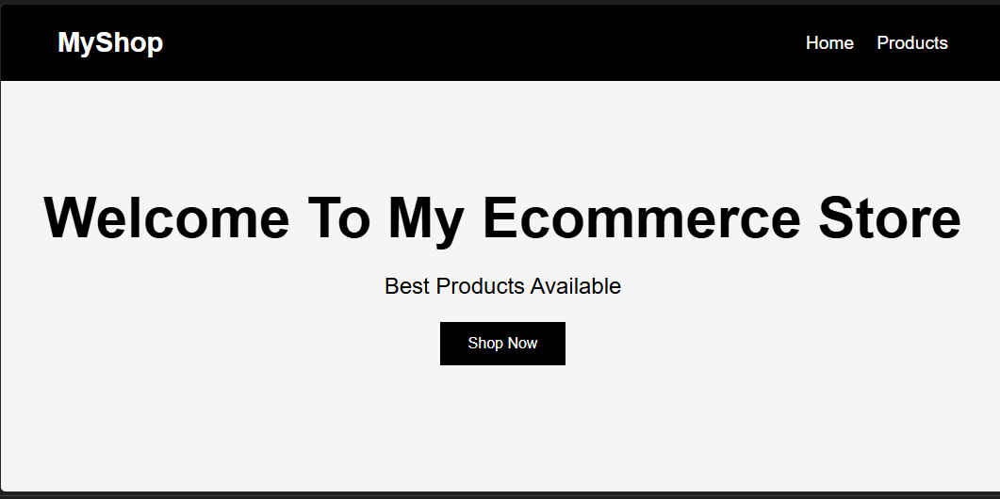
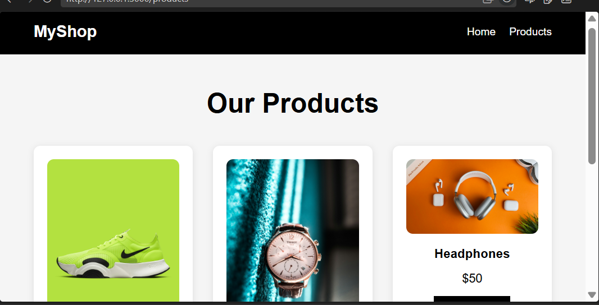
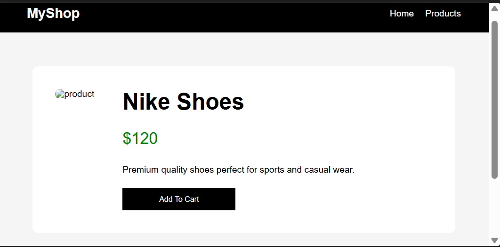

# Ecommerce Project

A responsive ecommerce web application built using Flask, HTML, CSS, and Python.

---

# Features

- Responsive Home Page
- Product Listing Page
- Product Details Page
- Flask Backend Routing
- Mobile Friendly Design
- Product Cards Layout
- Navigation Bar and Footer

---

# Technologies Used

- Python
- Flask
- HTML5
- CSS3

---

# Project Structure

ecommerce-project/
│
├── static/
│   ├── css/
│   │   └── style.css
│   │
│   ├── images/
│
├── templates/
│   ├── index.html
│   ├── products.html
│   └── product_details.html
│
├── screenshots/
│
├── app.py
├── requirements.txt
└── README.md

---

# Routes

| Route | Description |
|-------|-------------|
| / | Home Page |
| /products | Products Listing Page |
| /product/<id> | Product Details Page |

---

# How To Run The Project

## 1. Clone Repository

git clone YOUR_GITHUB_REPOSITORY_LINK

---

## 2. Open Project Folder

cd ecommerce-project

---

## 3. Create Virtual Environment

Windows:

python -m venv venv

Linux:

python3 -m venv venv

---

## 4. Activate Virtual Environment

Windows:

venv\Scripts\activate

Linux:

source venv/bin/activate

---

## 5. Install Requirements

pip install -r requirements.txt

---

## 6. Run Flask Server

python app.py

---

# Open In Browser

http://127.0.0.1:5000

---

# Screenshots

## Home Page

## Products Page

## Product Details Page

---

# Future Improvements

- Database Integration
- User Authentication
- Search Functionality
- Add To Cart Feature
- Admin Dashboard

---

# Author

Developed by Areeba Sardar