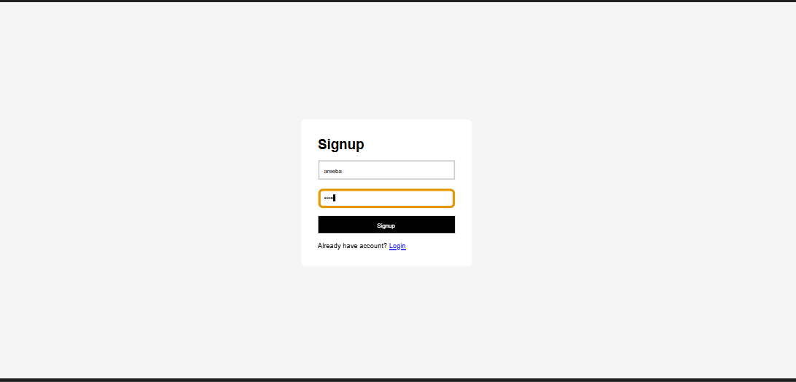
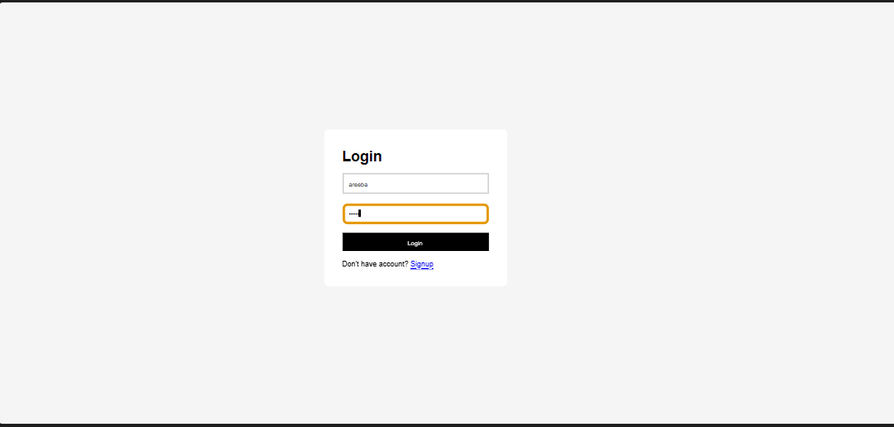
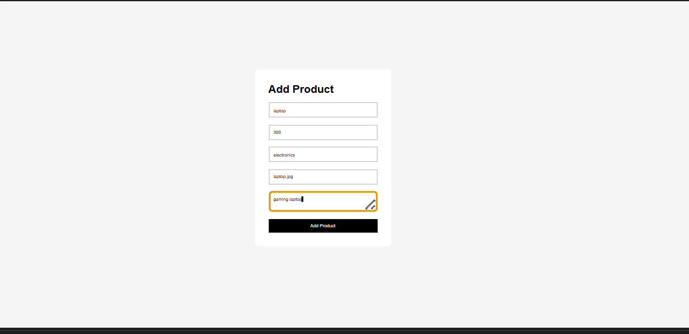
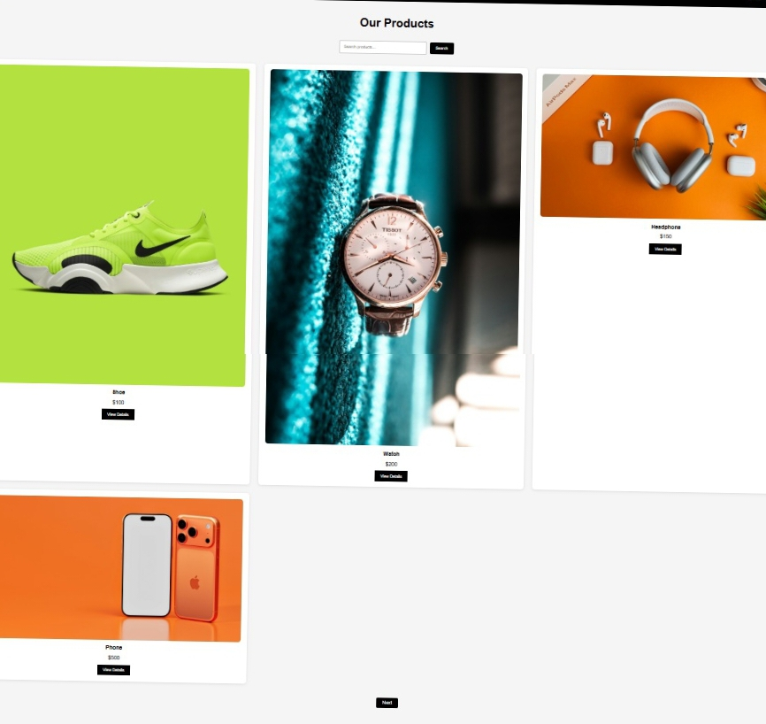
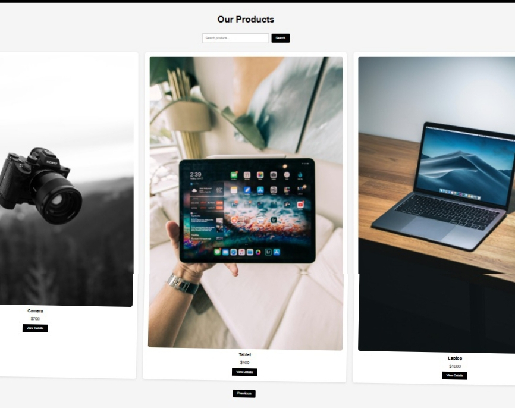

# Ecommerce Project - Week 3

A responsive ecommerce web application built using Flask, Python, HTML, CSS, SQLite, and Flask Authentication.

---

# Features

- Responsive Home Page
- Product Listing Page
- Product Details Page
- SQLite Database Integration
- Dynamic Product Rendering
- Search Functionality
- User Signup System
- User Login System
- User Authentication
- Protected Routes
- Add Product Functionality
- Pagination
- Mobile Responsive Design

---

# Technologies Used

- Python
- Flask
- Flask SQLAlchemy
- Flask Login
- HTML5
- CSS3
- SQLite

---

# Project Structure
```text
Week 3 task/
│
├── static/
│   ├── css/
│   │   └── style.css
│   │
│   └── images/
│       ├── shoe.jpg
│       ├── watch.jpg
│       ├── headphone.jpg
│       ├── laptop.jpg
│       ├── phone.jpg
│       ├── tablet.jpg
│       └── camera.jpg
│
├── templates/
│   ├── index.html
│   ├── products.html
│   ├── product_details.html
│   ├── login.html
│   ├── signup.html
│   └── add_product.html
│
├── screenshots/
│   ├── signup-page.png
│   ├── login-page.png
│   ├── add-product-page.png
│   ├── pagination-page-1.jpeg
│   └── pagination-page-2.jpeg
│
├── instance/
│   └── products.db
│
├── app.py
├── seed.py
├── requirements.txt
└── README.md
```

---

# Routes

| Route | Description |
|-------|-------------|
| / | Home Page |
| /products | Product Listing Page |
| /product/<id> | Product Details Page |
| /signup | User Signup |
| /login | User Login |
| /logout | User Logout |
| /add-product | Add Product Page |

---

# How To Run The Project

## 1. Open Project Folder

cd week3

---

## 2. Create Virtual Environment

Windows:

python -m venv venv

Linux:

python3 -m venv venv

---

## 3. Activate Virtual Environment

Windows:

venv\Scripts\activate

Linux:

source venv/bin/activate

---

## 4. Install Requirements

pip install -r requirements.txt

---

## 5. Run Flask Server

python app.py

---

# Open In Browser

http://127.0.0.1:5000

---

# Screenshots

## Signup Page


## Login Page


## Add Product Page


## Pagination Page 1


## Pagination Page 2


---

# Week 3 Features

- User Authentication
- Login and Signup System
- Protected Routes
- Add Product Functionality
- Pagination
- Dynamic Product Rendering
- Responsive Design

---

# Author

Developed by Areeba Sardar
